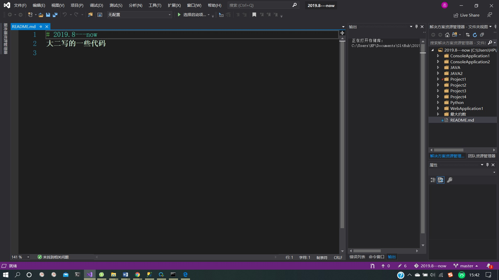
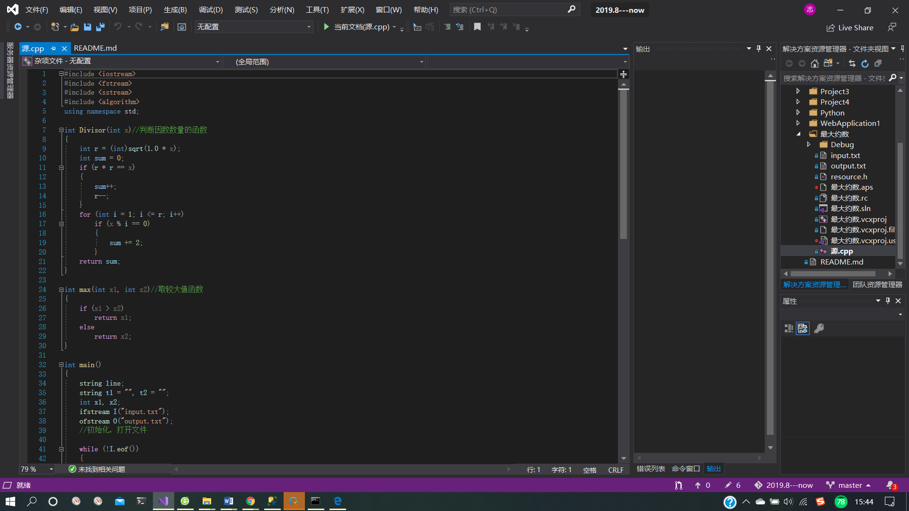
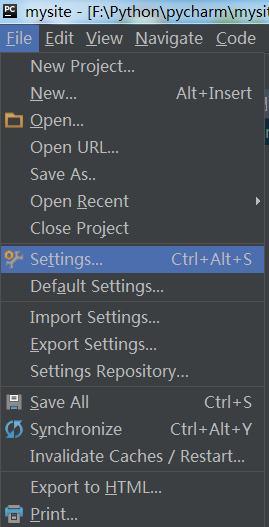
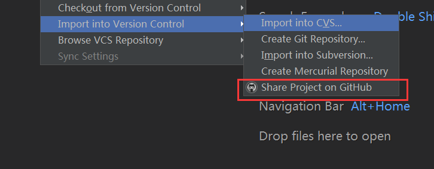

# 摘要（附GitHub链接：https://github.com/JNU-Coder ）
其实在大一结束时我就注册了一个GitHub的账号，用来管理程序设计大作业的有关代码，不过暑假过后就将其弃置一旁，没有碰过了。时隔半年，如今又重新用学校的企业邮箱注册了一个GitHub账号。在实验课后的这两天，我了解了git的使用方法，掌握了使用git命令建立、拉取、更新、删除repositories，建立、上传文件以及回退到历史版本的方法。同时我也掌握了GitHub Desktop的具体用法，同时也熟悉了用Visual Studio、PyCharm、Idea等常用IDE通过GitHub管理代码的方法。这让我对GitHub又有了一个新的认识，相信以后能够更好地利用这一工具！
# Git和GitHub的简单使用
### 在查阅了不少博客和官方文档并经过实践后，我总结了Git和Github的基本用法

### Git创建仓库
###### 创建GitHub应用（建立博客时使用Gittalk时用到过）
>1、右击头像，在下拉菜单中选择Settings
>2、在Personal settings中选择OAuth applications，再选择Developer applications
>3、点击Register a new application，填写相应设置
>4、点击Register applciation注册应用，记住Client ID和Client Secret
###### 在需要建立仓库的地方打开git bash

>echo "项目名称" >> README.md
	git init
	git add README.md
	git commit -m "first commit"
	git remote add origin git@github.com/JNU-coder/项目名.git
	git push -u origin master

###### 若仓库存在则直接push

>git remote add origin git@github.com/JNU-Coder/项目名.git
	git push -u origin master

###### 创建仓库初始化操作
>//在当前指定目录下创建
	git init
	//新建一个仓库目录
	git init [项目名]
	//克隆一个远程项目
	git clone [url]

###### 配置用户信息

>//设置提交代码时的用户信息
	git config [--global] user.name "[name]"
	git config [--global] user.email "[email address]"	
	
###### 提交或暂存代码
>//提交暂存区到仓库区
	git commit -m "my commit"
	//提交暂存区的指定文件到仓库区
	git commit [file1] [file2] ... -m [message]
	//提交工作区自上次commit之后的变化，直接到仓库区
	git commit -a
	//提交时显示所有diff信息
	git commit -v
	//提交代码到主分支
	git push -u origin master
	
###### 远程同步

>//显示所有远程仓库
	git remote -v
	//增加一个新的远程仓库，并命名
	git remote add [shortname] [url]
	//显示某个远程仓库的信息
	git remote show [remote]
	//上传本地指定分支到远程仓库
	git push [remote] [branch]
	//推送所有分支到远程仓库
	git push [remote] --all
	//强行推送当前分支到远程仓库，即使有冲突
	git push [remote] --force
	//获取远程仓库的所有变动
	git fetch [remote]
	//取回远程仓库的变化，并与本地分支合并
	git pull [remote] [branch]

	
###### 分支

>//列出本地分支
	git branch
	//列出远程分支
	git branch -r
	//列出本地和远程分支
	git branch -a
	//新建一个分支，但依然停留在当前分支
	git branch [branch-name]
	//新建一个分支，并切换到该分支
	git checkout -b [branch]
	//切换到上一个分支
	git checkout -
	//合并指定分支到当前分支
	git merge [branch]
	//删除分支
	git branch -d [branch-name]
	//删除远程分支
	$ git push origin --delete [branch-name]

###### 查看信息

>//显示有变更的文件
	git status
	//显示当前分支的版本历史
	git log
	//显示commit历史，以及每次commit发生变更的文件
	git log --stat
	//搜索提交历史，根据关键词
	git log -S [keyword]
	//显示某个文件的版本历史，包括文件改名
	git log --follow [filename]
	
###### 撤回历史版本
	
>//查询历史对应不同版本的ID ，用于回退使用
>git log --pretty=oneline
//恢复到历史版本
git reset --hard [版本ID]
//把修改推到远程服务器
git push -f -u origin master 

### GitHub在IDE中的使用
###### GitHub用于IDE的代码管理还是作用非凡的，我用GitHub同步了上大学以来所有的代码（大作业的代码找不到了。。。）

###### Github在VS中的使用
>1、首先，需要打开【扩展或更新】安装插件【Github Extension for VisualStudio】
>2、登陆GitHub账号后，在团队资源管理中可以Clone已经有的库到本地，或者可以新建库同步到GitHub上
>3、在团队资源管理中可以对项目进行更改，同步

###### GitHub在PyCharm中的使用
>1、配置PyCharm的GitHub和Git，（安装好git是前提）
>
>2、克隆远程GitHub仓库
>
>3、导入完成后在Github中查看上传文件或仓库

###### GitHub在Idea中的使用
>1、在Idea 里面做相关配置：将版本控制工具设置为git
>2、点击第六项 GitHub，然后Host一栏填写github 的地址，在 Login 一栏填写你的github 账号，Password 一栏填写密码，填写完成后确认即可
>3、创建项目：选择VCS- > Import into Version Control -> Create Git Repository
>4、选择【项目】： ->Git ->Repository -Push  即可将本地的文件推送到远程仓库中

### 利用GitHub和jekyll建立静态博客

###### 很久之前就有建立博客的想法了，不过一直没有付诸行动，这次趁这个机会，在网上找了大量的教程，终于把博客的大体的框架搭建好了（借助了模板）。这也是我的第一篇博客。

# 总结
### 通过这次的实验以及这两天的折腾，我认为我对GitHub的基本使用有了更为深入的了解，能够应对一般情况下的应用场景，相信结果这一学期接下来的学习，我一定能够有所进步！
# 最后，非常感谢老师的阅读！如有兴趣，欢迎阅读我的博客：https://jnu-coder.github.io/ （虽然现在只有一篇。。。）
